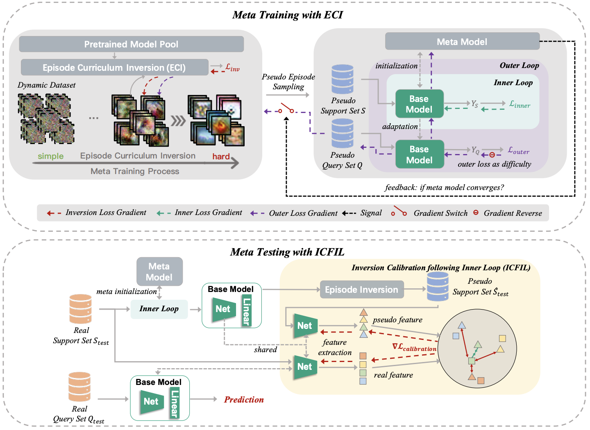

# Official Pytorch Implementation for "Architecture, Dataset and Model-Scale Agnostic Data-free Meta-Learning" (CVPR-2023)

**New**: We release an extension version of our PURER [here](https://github.com/Egg-Hu/PURER-Plus). PURER-Plus can

1. work well with ProtoNet (metric-based) and ANIL/MAML (optimization-based);
2. work well with a larger number of pre-trained models with overlapping label spece.

## Paper & Framework:

For our paper accepted by [CVPR-2023](https://cvpr2023.thecvf.com/), please refer to

 [[camera-ready](https://openaccess.thecvf.com/content/CVPR2023/papers/Hu_Architecture_Dataset_and_Model-Scale_Agnostic_Data-Free_Meta-Learning_CVPR_2023_paper.pdf)],  [[arxiv](https://arxiv.org/abs/2303.11183)], [[poster](https://cvpr2023.thecvf.com/media/PosterPDFs/CVPR%202023/21544.png?t=1685382758.3929415)], [[slide](https://cvpr2023.thecvf.com/media/cvpr-2023/Slides/21544.pdf)], [[video](https://www.youtube.com/watch?v=lQiRUJ2BJII)].




## Prerequisites:

* python == 3.8.15
* torch == 1.13.1

## Datasets & Pre-trained Modes:

**Datasets:**

* **CIFAR-FS:** 

  * Please manually download the CIFAR-FS dataset from [here](https://drive.google.com/file/d/19OemApI1Mc6b69xHh80NGRGTklLP961g/view?usp=sharing) to obtain "cifar100.zip".

  * Unzip ".zip". The directory structure is presented as follows:

    ```css
    cifar100
    ├─mete_train
    	├─apple (label_directory)
    		└─ ***.png (image_file)
    	...
    ├─mete_val
    	├─ ...
    		├─ ...
    └─mete_test
    	├─ ...
    		├─ ...
    ```

  * Place it in "./DFL2Ldata/".

* **Mini-Imagenet:** Please manually download it [here](https://drive.google.com/file/d/1X6YHK9NeWAwieodruib1rG5SqxhirbHC/view?usp=sharing). Unzip and then place it in "./DFL2Ldata/".

* **CUB:** Please manually download it [here](https://drive.google.com/file/d/1E0TPIwRUJAoDe7vb8fCcJWdzKv2I5k3O/view?usp=sharing). Unzip and then place it in "./DFL2Ldata/".

* **Flower:** Please manually download it [here]()(on-going). Unzip and then place it in "./DFL2Ldata/".

**Pre-trained models:**

- You can download the pre-trained models [here ]()(on-going) , and then place it in "./PURER". Or you can pre-train your own models following the instructions below (Step 3).

## Quick Start:

1. Make sure that the root directory is "./PURER".

2. Prepare the dataset files.

   - For CIFAR-FS:

     ```shell
     python ./write_cifar100_filelist.py
     ```

     After running, you will obtain "meta_train.csv", "meta_val.csv", and "meta_test.csv" files under "./DFL2Ldata/cifar100/split/".

   - For MiniImageNet:
     ```shell
     python ./write_miniimagenet_filelist.py
     ```
     
     After running, you will obtain "meta_train.csv", "meta_val.csv", and "meta_test.csv" files under "./DFL2Ldata/Miniimagenet/split/".
     
   - For CUB:
     ```shell
     python ./write_CUB_filelist.py
     ```
     After running, you will obtain "meta_train.csv", "meta_val.csv", and "meta_test.csv" files under "./DFL2Ldata/CUB_200_2011/split/".
     
   - For Flower:
     ```shell
     python ./write_flower_filelist.py
     ```
     After running, you will obtain "meta_train.csv", "meta_val.csv", and "meta_test.csv" files under "./DFL2Ldata/flower/split/".
   
3. Prepare the pre-trained models.

    ```shell
    bash ./scripts/pretrain.sh
    ```
	
    Some options you may change:

    |     Option     |               Help               |
    | :------------: | :------------------------------: |
    |   --dataset    | cifar100/miniimagenet/cub/flower |
    | --pre_backbone |     conv4/resnet10/resnet18      |

4. Meta training
   - For 5-way 1-shot learning on models(Conv4) from CIFAR-FS:
     ```shell
      bash ./scripts/cifar_51_conv4.sh
     ```
   - For 5-way 5-shot learning on models(Conv4) from CIFAR-FS:
     ```shell
      bash ./scripts/cifar_55_conv4.sh
     ```
     
   
   Some options you may change:
   
   |     Option     |           Help            |
   | :------------: | :-----------------------: |
   |   --dataset    | cifar100/miniimagenet/cub/flower|
   | --num_sup_train |  1 for 1-shot, 5 for 5-shot  |
   | --backbone |  conv4, the architecture of meta model  |
   | --pre_backbone |  conv4/resnet10/resnet18|
   | --adv_scale |  value of cofficient  |
   | --adv_start |  warmup  |

## Citation:

If you find this code is useful to your research, please consider to cite our paper.

```
@inproceedings{hu2023architecture,
  title={Architecture, Dataset and Model-Scale Agnostic Data-free Meta-Learning},
  author={Hu, Zixuan and Shen, Li and Wang, Zhenyi and Liu, Tongliang and Yuan, Chun and Tao, Dacheng},
  booktitle={Proceedings of the IEEE/CVF Conference on Computer Vision and Pattern Recognition},
  pages={7736--7745},
  year={2023}
}
```

## Acknowledgements:

Some codes are inspired from [DeepInversion](https://github.com/NVlabs/DeepInversion) and [CloserLookFewShot](https://github.com/wyharveychen/CloserLookFewShot/tree/master).

## Contact:

* **Zixuan Hu:**  huzixuan21@mails.tsinghua.edu.cn

